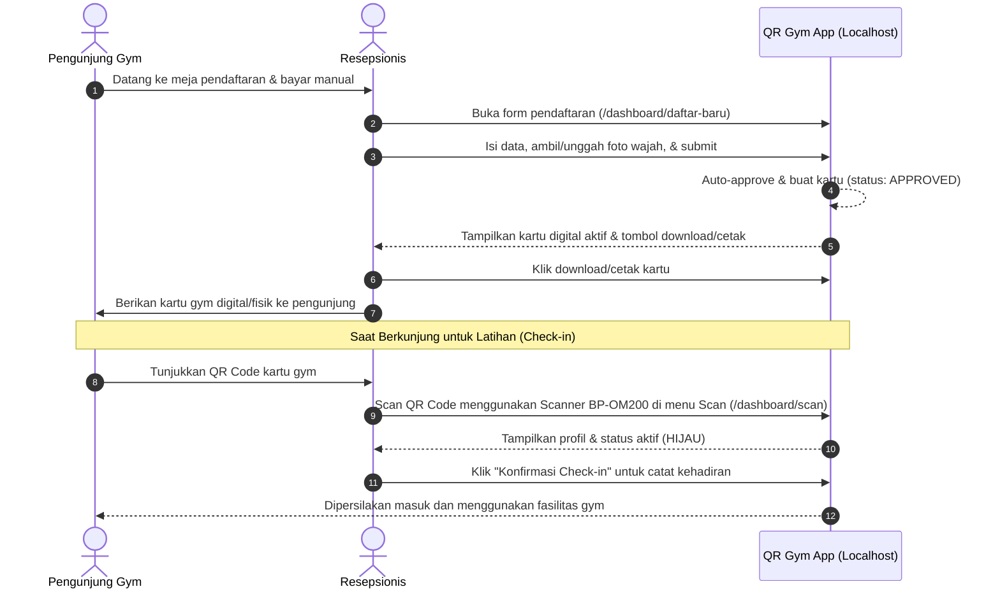
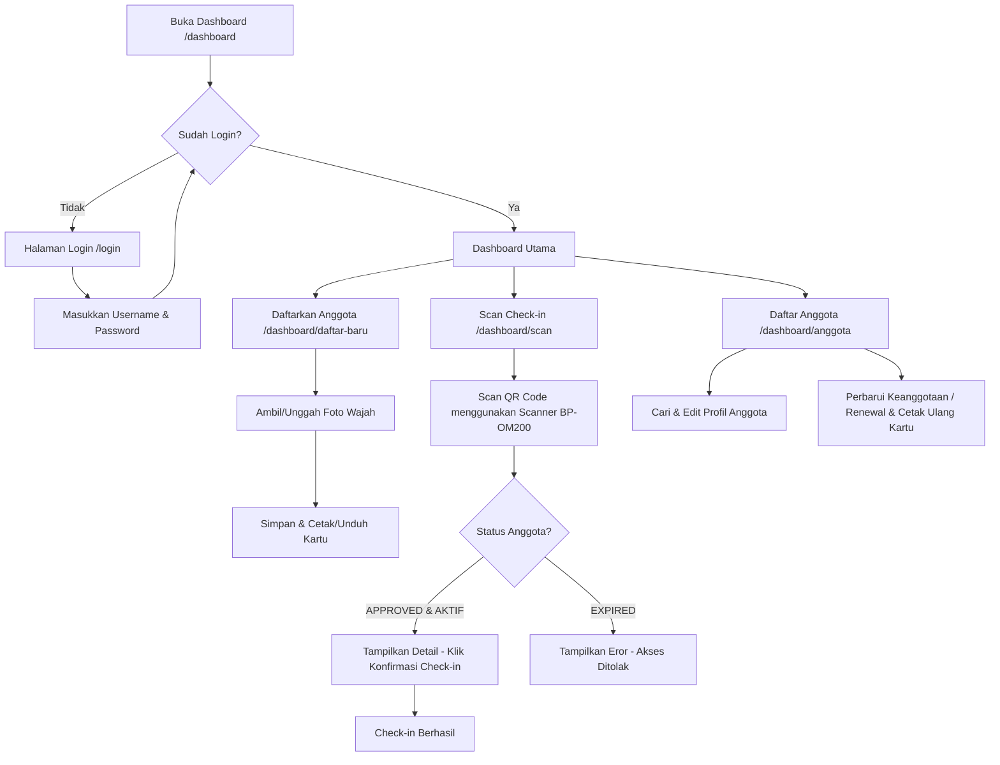

# Application Flows (Receptionist-Only)

This document details the registration, check-in, and administrative flows within the QR Gym application.

## System Architecture Flow

### Detailed Steps:
1. **Pendaftaran & Pembayaran**: Pengunjung mendaftar secara langsung di front desk. Resepsionis menerima pembayaran tunai atau transfer, lalu mengisi form pendaftaran di `/dashboard/daftar-baru` pada AIO PC.
2. **Pengambilan Foto Wajah**: Foto profil diambil langsung menggunakan kamera depan (webcam) AIO PC, atau dengan mengunggah file foto jika kamera tidak tersedia.
3. **Penerbitan Kartu Otomatis**: Setelah disimpan, status anggota langsung aktif (`APPROVED`). Sistem menampilkan kartu keanggotaan digital secara instan dengan QR Code (UUID).
4. **Cetak & Download Kartu**: Resepsionis mengunduh kartu sebagai gambar PNG atau langsung mencetaknya untuk diberikan kepada anggota.
5. **Check-in Kehadiran**: Setiap kali berkunjung, anggota memindai QR Code kartu mereka menggunakan scanner fisik **BP-OM200** yang terhubung ke AIO PC. Resepsionis mengonfirmasi check-in di layar dashboard.

---

## Receptionist Dashboard Navigation

### Detailed Operations:
1. **Autentikasi**: Resepsionis masuk ke sistem via `/login` menggunakan akun tunggal (`admin` / `admin123`).
2. **Pendaftaran Anggota**: Dilakukan di menu `Daftarkan Anggota`. Semua input divalidasi, dan pendaftaran langsung disetujui tanpa antrian persetujuan tambahan.
3. **Pencatatan Kehadiran (Scan Check-in)**: Anggota mengarahkan QR Code ke scanner **BP-OM200** yang bertindak sebagai USB HID Keyboard Emulation. String UUID secara otomatis dibaca dan diproses:
   - Jika keanggotaan aktif (`APPROVED` & belum kedaluwarsa), profil pengunjung muncul dengan status hijau. Resepsionis mengklik **Konfirmasi Check-in** untuk menyimpan riwayat kehadiran.
   - Jika keanggotaan habis/kedaluwarsa, tombol konfirmasi diblokir dan status berwarna merah **EXPIRED**.
4. **Perpanjangan (Renewal)**: Jika masa aktif habis, resepsionis mencari profil anggota di menu `Daftar Anggota`, memilih opsi durasi perpanjangan (Harian/Bulanan), memproses pembayaran manual, lalu memperbarui masa aktif. Setelah diperbarui, kartu digital dengan tanggal validitas baru dapat dicetak kembali.
